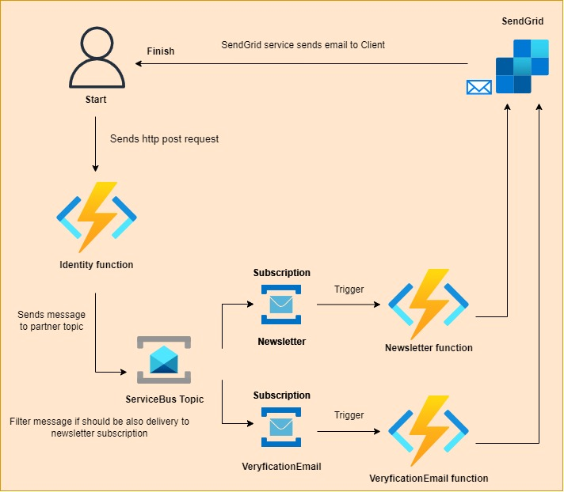

## Introduction
The main objective was to create micro services that make particular tasks.

Presented use case refers to the flow which is performed when an account is created for a client and system want to send a veryfication and newsletter emails.



## Flow
User sends http post request with payload, which indicating data for registering a new account:
```json
{
    "FirstName": "Phill",
    "LastName": "Cash",
    "Email": "phill.cash@gmail.com",
    "IsNewsletterSubscriber": true
}
```
Then, `IdentityFunction` processes payload, create an account and send message to serviceBus topic `notification`.

Next, the serviceBus topic is responsible for delivery message to 'veryficationEmail' subscription and filter message if should be also sent to 'newsletter' subscription, it depends on `IsNewsletterSubscriber` value from previous request's payload.

'VeryficationEmail' and 'Newsletter' functions are triggered automatically, depending on whether on a particular subscription is a waiting message. 

Functions has connection with sendGrid api, so in the end of the process, user will get veryfication and newsletter email.  

## Components
* ServiceBus - Message Broker
* Functions app - Serverless applications
* SendGrid - SaaS solution to delivery emails
* Terraform - Build azure infrastructure